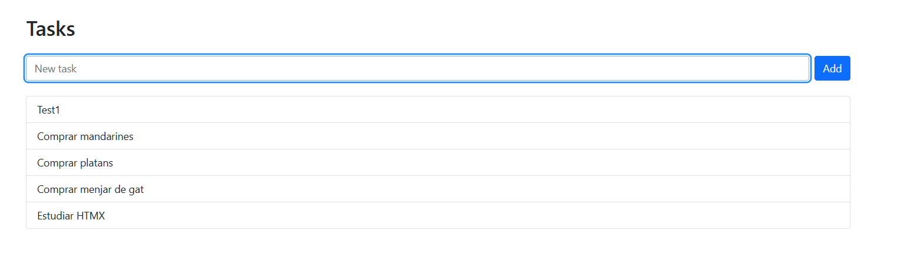
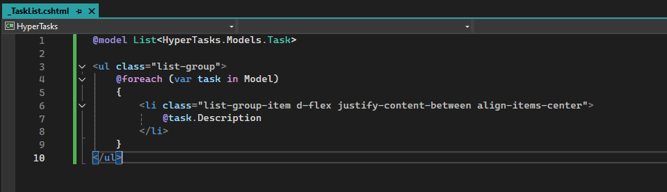

# HyperTasks

**HyperTasks** is a simple but expressive demo built with **ASP.NET Core Razor Pages** and **htmx**, showcasing how to build interactive web applications using hypermedia principles — without relying on JavaScript frameworks or JSON-based APIs.

---

## 📸 Preview



---

## ✨ Features

- Interactive task list with dynamic add functionality
- Built using Razor Pages (Server-Side Rendering)
- Uses [htmx](https://htmx.org) for partial updates via `GET` and `POST`
- No JavaScript frameworks required
- Styled with Bootstrap (locally installed)

---

## 🔧 Technologies

- .NET 8 Razor Pages
- htmx 1.9.2 (local)
- Bootstrap 5 (local)
- HTML partial rendering
- Minimal C#, no async (in-memory storage)

---

## 🚀 Getting Started

1. Clone the repository:

2. Run the project:

```bash
dotnet run
```

3. Navigate to:

```
https://localhost:PORT/
```

---

## 📁 Project Structure

```bash
├── Models/
│   └── Tarea.cs
├── Services/
│   └── TaskService.cs
├── Pages/
│   ├── Tasks.cshtml
│   ├── Tasks.cshtml.cs
│   └── Shared/
│       └── _TaskList.cshtml
├── wwwroot/
│   ├── js/htmx.min.js
│   ├── js/bootstrap.bundle.min.js
│   └── css/bootstrap.min.css
```

---

## 🧩 Core HTML (Page: `Tasks.cshtml`)


- Uses `hx-get`, `hx-post`, `hx-target`, and `hx-swap`
- Trigger on page load and form submit

---

## 🎯 Handlers (`Tasks.cshtml.cs`)


- `OnGetList()` returns the rendered task list
- `OnPostAdd()` adds a new task and returns updated list

---

## 🧱 Partial View (`_TaskList.cshtml`)



Renders tasks using Bootstrap:

```html
<ul class="list-group">
  <li class="list-group-item">Task 1</li>
  <li class="list-group-item">Task 2</li>
</ul>
```

---

## 📚 Learning Goals

This project demonstrates:

- How hypermedia concepts apply to web UI
- How htmx allows server-driven UI updates
- How Razor Pages enable SSR with minimal setup
- How to avoid overengineering with JS frameworks

---

## 📄 License

MIT
